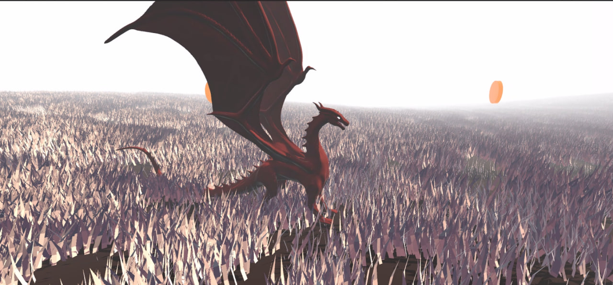

# Dragon Money

> ⚙️ Проект находится в разработке

Симулятор дракона, в котором игрок исследует мир и собирает монеты.

---

## Реализовано

- Создан ландшафт игрового мира.
- Создана low-poly модель персонажа на основе high-poly скульпта.
- Выполнена ретопология с использованием Quad Remesher.
- Выполнено запекание данных с high-poly модели на low-poly модель в Blender.
- Реализована механика перемещения персонажа:
  - ходьба;
  - бег;
  - прыжок;
  - полёт.
- Реализовано следование камеры за персонажем.

---

## В разработке

- Анимации персонажа.
- Текстурирование персонажа.
- Оптимизация растительности и ландшафта.
- Процедурная генерация игрового мира.
